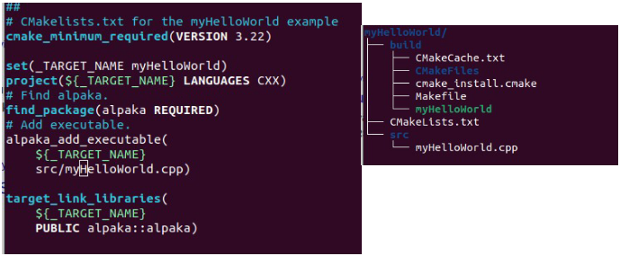

# Alpaka Training and Documentation Links

- **Training links for October 2024:**
  - [HandsOn Session Documentation](https://github.com/mehmetyusufoglu/alpaka-workshop-slides/blob/workshopOct2024/other-events/2024-October-Workshop/alpaka_merged_with_copy_buttons.md)
- **Git Repository:** [https://github.com/alpaka-group/alpaka](https://github.com/alpaka-group/alpaka)
- **Alpaka Documentation:**
  - Main Page: [https://alpaka.readthedocs.io/en/latest/index.html](https://alpaka.readthedocs.io/en/latest/index.html)
  - [Installation Guide](https://alpaka.readthedocs.io/en/latest/)
  - [Cheat Sheet](https://alpaka.readthedocs.io/en/latest/basic/cheatsheet.html)
  - [CMake Variables](https://alpaka.readthedocs.io/en/latest/advanced/cmake.html)
  - [API Docs](https://alpaka-group.github.io/alpaka/)
- **Webinar May 2024: Alpaka concepts and usage**
  - [Webinar Slides (pdf)](https://github.com/alpaka-group/alpaka-workshop-slides/blob/d40c44081c53041ce618205167c130c973c9b41e/slides-2024/UsingAlpakaForPlasmaPepscWebinar28May2024.pdf)
  


# Hands-on Session Guide

## I - Install Dependencies

- **alpaka** requires Boost, CMake, and a modern C++ compiler (g++, clang++, Visual C++, etc.).

### Linux:
- Install Boost:
  ```bash
  sudo apt install libboost-all-dev
  ```

### macOS:
- Install Boost using Homebrew:
  ```bash
  brew install boost
  ```
  [Homebrew](https://brew.sh)

### Windows:
- Install Boost using vcpkg:
  ```bash
  vcpkg install boost
  ```
  [vcpkg](https://github.com/microsoft/vcpkg)

### Additional Packages (Depending on Your Target Platform):
- **NVIDIA GPUs**: [CUDA Toolkit](https://developer.nvidia.com/cuda-toolkit)
- **AMD GPUs**: [ROCm / HIP](https://rocmdocs.amd.com/en/latest/index.html)
- **Intel GPUs**: [OneAPI Toolkit](https://www.intel.com/content/www/us/en/developer/tools/oneapi/base-toolkit.html#gs.9x3lnh)

### CMake is the Preferred System for Building and Installing:
- **Linux**:
  ```bash
  sudo apt install cmake
  ```
- **macOS and Windows**: Download the installer from [cmake.org/download](https://cmake.org/download/)

## II - Compiling and Running Examples

- You can build all examples at once from your build directory
- Configure the build with setting some CMake variables according to your system:
  ```bash
  cmake -Dalpaka_BUILD_EXAMPLES=ON -DCMAKE_BUILD_TYPE=Release \
        -Dalpaka_ACC_CPU_B_SEQ_T_SEQ_ENABLE=ON \
        -Dalpaka_ACC_GPU_CUDA_ENABLE=ON ..
  ```
  
  - ALPAKA_ACC_GPU_HIP_ENABLED for running on AMD GPUs
  - ALPAKA_ACC_GPU_SYCL_INTEL for running on Intel GPUs
  - ALPAKA_ACC_CPU_B_SEQ_T_SEQ_ENABLED for running serially on a CPU
  - ALPAKA_ACC_GPU_CUDA_ENABLED for running on NVIDIA GPUs
  - ....
  
  In case mdspan is going to be used  
- Build the examples:
  ```bash
  cmake --build . --config Release
  ```

- The `alpaka/build/example/` directory will include compiled examples.
  - For example, `alpaka/build/example/vectorAdd` will contain the `vectorAdd` executable.
- Run all examples from the build directory of Alpaka:
  ```bash
  ctest example/
  ```

- Run all tests from the build directory of Alpaka if the `BUILD_TESTING` CMake variable is set to `ON`:
  ```bash
  ctest test/
  ```

- Examples can be re-compiled and run in their corresponding directories under the build directory if there is a code change in the source tree:
  ```bash
  cd alpaka/build/example/vectorAdd
  cmake --build .  # or run the make command if a Makefile is present
  ```

## III - Install Alpaka Library

- **Download alpaka**:
  ```bash
  git clone -b develop https://github.com/alpaka-group/alpaka.git
  ```

- **In the terminal/powershell, switch to the downloaded alpaka directory**:
  ```bash
  cd /path/to/alpaka
  ```

- **Create a build directory and switch to it**:
  ```bash
  mkdir build 
  cd build
  ```

- **Configure the build directory**:
  - If the default directories are fine or if you plan to use alpaka from the build directory, you can omit the `install prefix` CMake variable.
  ```bash
  cmake -DCMAKE_INSTALL_PREFIX=/some/other/path/ ..
  ```

- **Install alpaka**:
  - Direct installation is possible because alpaka is a header-only library. The alpaka installation will reside in `/some/other/path/`.
  ```bash
  cmake --install .
  ```
  
- You should now have a complete alpaka installation in the directory you chose earlier.


# IV - Compile and run your project
1. After installation, create your `CMakeLists.txt` file as shown below in a new project directory. Use `find_package(alpaka REQUIRED)` to locate the Alpaka library. 



2. Create your C++ code (possibly under the `src` directory of the project directory).
3. Inside the directory of your project, run the following commands:
   ```bash
   mkdir build 
   cd build
   ```
4. Configure your project by setting the relevant CMake variables to `ON` according to your system and :
   ```bash
   cmake -DCMAKE_BUILD_TYPE=Release \
         -Dalpaka_ACC_CPU_B_SEQ_T_SEQ_ENABLE=ON \
         -Dalpaka_ACC_GPU_HIP_ENABLE=ON ..
   ```
5. Don't forget to set MdSpan alpaka cmake variable if mdspan is going to be used: -Dalpaka_USE_MDSPAN=FETCH. Alpaka will fetch the mdspan from the mdspan repository.      
    ```bash
    cmake -DCMAKE_BUILD_TYPE=Release \
          -Dalpaka_ACC_CPU_B_SEQ_T_SEQ_ENABLE=ON \
          -Dalpaka_ACC_GPU_HIP_ENABLE=ON
          -Dalpaka_USE_MDSPAN=FETCH ..
    ```
6. Build your code:
   ```bash
   cmake --build . --config Release
   ```


For detailed information, visit:
[Alpaka Workshop Slides](https://github.com/alpaka-group/alpaka-workshop-slides/tree/develop)

